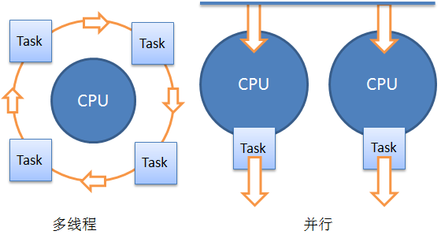
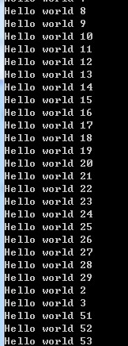

VS2010明天就要发布了，伴随而来的是.NET
Framework第四个版本的发布，借这个机会，聊聊相对于3.5，4又多了哪些新的特性。

我们知道，.NET
Framework是一个渐近发展的框架，自从2.0开始，框架底层本身并没有太大的变化，CLR的版本都是2.0的，4的发布是一个质飞跃，微软直接跳过了CLR 3.0的版本而将.NET Framework的版本更新为4，如此看来，先前3.0，3.5的程序可以在2.0的运行时上运行，想在新的运行时上运行的话必须要重新编译了。

.Net Framework 3.0加入了一些诸如WPF,WCF,WF,WCS的东西，3.5又更新了一些EF，LINQ的新特性，那么我们有理由相信4也将会带给我们更多的惊喜，这个惊喜便是：Parallel和DLR。

## GC
CLR 2.0的运行机制大家一定很熟悉了，CLR为应用程序分配内存并且在适当的时候执行垃圾回收来释放内存。这里所说的适当可以理解为系统内存数量低或者其他对内存需求超过程合理范围的时候。

GC是怎么判断一个对象该执行清理了呢？CLR在内部建立了对象图来确定一个对象是否引用数为0，为0也就是不可达，清理之。CLR将分配内存的对象标记为0代，1代，2代，新分配的对象默认为0代，当CLR执行一次GC操作后没有被清理的对象将上升为1代，再清理，再升为2代，再清理，还是2代……不用多想，在CLR 2.0中最高就是2代。

GC的工作模式有3种：`workstation`, `concurrent workstation`, `server`，其中`workstation`是默认模式，而`server`模式用于多CPU服务器环境。`workstation`自不必细说，但是`concurrent workstation`模式下当一个GC正在执行中时，其他的GC是无法同时执行的。换句话讲，在`concurrent workstation`下GC的执行效率并不高，而`server`模式会开启一个新线程来进行GC操作，然而单个CPU上执行GC却和`concurrent workstation`相同。

那么CLR 4会有什么新的特性呢？一切为了效率，一切为了并行！CLR 4提出了后台GC来替代`concurrent
workstation`模式。后台GC支持与其他的GC同时执行。换句话讲，减少了GC执行的时间，资源可以更早的被释放。

但是后台GC这种特性在server模式上却不可用，不知道在后续版本中会不会改进。

先前版本的GC运行机制详情请猛击[PriorGC](http://blog.csdn.net/isline/archive/2010/02/26/5328342.aspx)。

Cool，与Parallel不谋而合，并行真是大势所趋……

## 线程
线程上的改进主要在线程池上。

先前的线程池在获取线程信息上是很困难的，这不利于我们优化程序，于是.NET
4新提出了一个新的更加友好的数据结构：Task，较先前的ThreadPool而言效率更高，对GC也更加的友好。

一个简单的示例：

在.NET 4以前的版本里，我们可以这样使用线程池：

```csharp
ThreadPool.QueueUserWorkItem(_ => {
	Console.WriteLine("Hello world!");
});
```
而在.NET 4中我们多了些选择：

```csharp
Task newTask = Task.Factory.StartNew(() => Console.WriteLine("Hello world!"));
```
但是要注意到的是，现在我们可以通过程newTask.Status来获取一个TaskStatus枚举，这个枚举说明了当前Task的执行状态，当然了，还有很多的属性，总之，可以获取很多的运行时状态，而这一切在ThreadPool是做不到的。

## 并行
说到线程上的改进就不能不提.NET 4的并行特性。新加入的支持并行特性的有

* TPL(Task Parallel Library并行任务库)和CCR(Concurrency and Coordination Runtime并发与协调运行时)
* PLINQ(并行LINQ)
* 并发数据结构
* PPL(Parallel Pattern Library并行模式库)

当然了，还有一些支持并行开发的必要工具。大家知道并发和并行是两个不同的概念，主要体现在对CPU的使用方式上不同。并发多指的是多线程，而并行是多CPU同步执行，一个图示如下：



但是值得注意的是，并线与多线程会加重程序的复杂度。并行程序可以显著提高程序在多CPU环境下的执行效率，然而同步与死锁的问题仍然没有完美的解决，并且难于调试(虽然VS2010的IDE提供了很大的支持)，与多线程相同，在开发时要注意这一点。

.NET 4下使用并行来编程，经常用到的是`System.Threading.Tasks.Parallel`结构，我们可以写个简单的代码来看看。

```csharp
Parallel.For(0, 100, i => {
	Console.WriteLine("Hello world " + i);
});
```
第一个参数代表初始循环的值，第二个参数代表循环上限，第三个是Lambda表达式，传入的参数是当前任务的循环号，换种理解方式，我们可以将上述代码意淫为这样：

1
Parallel.Run(i => Console.WriteLine("Hello world " + i));
当然了，真正的Parallel数据结构是没有这个方法的。

让我们猜一下运行结果：`Hello world 0,Hello world 1,……`？

答案是，不一定，如果将100改为10的话，或许是这样，但如果是100甚至更高的话，这个结果就不一定了。

因为是并行的，所以Console.WriteLine的“任务”可能是随机分配到某个CPU上，当任务数量小时，由于CPU速度很快，可能会出现貌似顺序执行的情形，但是当任务不断的复杂，数量不断增多时再测试，结果就不一样了。



`Parallel.For`还可以传入一个`ParallelOptions`结构来指定一些执行选项，例如下面的代码可以指定CPU的数量：

```csharp
ParallelOptions taskOptions = new ParallelOptions { MaxDegreeOfParallelism = 2 };
Parallel.For(0, 100, taskOptions, x => {
	//并行执行
});
```
当然了，Parallel也可以指定一个`IEnumerable`集合，来迭代执行操作集合中的数据，这要使用`Parallel.ForEach`方法：

```csharp
Parallel.ForEach(DataCollection, data => {
	DoSomething(data);
});
```
这里不得不提的是，Parallel还是谨慎使用，如果在一些小任务的大量使用Parallel来执行的话，性能上的损失会很大，例如先前`Parallel.For`的例子，执行时明显感到有一段时间的停滞后程序才开始执行。

也许有人会奇怪，为什么使用Parallel非得指定循环号呢？其实也不一定了，使用循环主要是考虑到大部分的并行任务都具有连贯性，然而如果我们并行任务不具有相似性，可以这么做：

```csharp
Parallel.Invoke(
	() => { /*Task1*/ },
	() => { /*Task2*/ },
	() => { /*Task3*/ }
);
```
这个方法的参数是一个params数组，如些我们便可以指定所有的任务了。

## 全球化
为了适应多种语言环境，在开发时往往需要选择适当的资源进行本地化，.NET 4在全球化的改进在于将原先的203种文化支持提升到354种。为什么不只有汉语和英语两种文支持呢？咳咳，其实我也想把小日本和棒子们和谐掉……但是，算了，我们继续往下说。

这些改进是只为Windows 7用户的，因为文化的支持是要受操作系统的制约。确切的讲，在.NET的全球化特性中，中性文化的属性将返回其对就的最为主流的文化特定语言，使用先前版本创建的全球化资源将不能在新版本.NET中使用。并且，.NET的全球化特性将支持Unicode 5.1的标准。

在这个版本中，废除了WindowsOnlyCultures和FrameworkCultures两个结构，所以整个框架和操作系统更加的统一、“和谐”……

与此同时，TimeSpan结构也为新的全球化特性而新加了一些重载，例如Parse()，TryParse()，ParseExact()，TryParseExact()等均支持新的特定文化Format，这是一个好消息！

下一次将讨论.NET 4中关于安全、监测与分析等方面的内容，真正的BCL上的改进介绍我打算放在第三篇甚至第四篇上来介绍。

(To be continue….)