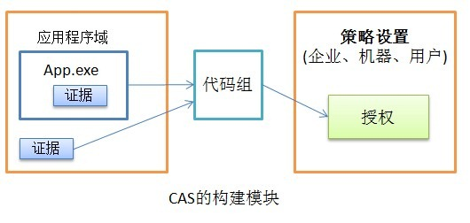

上一篇讨论了.NET 4中关于垃圾回收、线程、并行、全球化等方面的内容，这次我们接着上次往下说。

## 安全
安全是一个很大的概念。在.NET 4中，主要的改进在于对CAS操作的简化。

先前的版本中，如果想要控制资源的安全访问，那么就会使用CAS策略，但是操作往往很复杂，4改进了操作，主要体现在这些方面：

改进的透明模型。透明模型将代码分为了安全、不安全、或许安全，当然，这取决于程序宿主机的设置。于是.NET为不同应用程序设置了不同的安全类型，就像我们平常知道的那样，ASP.NET和SQL, Silverlight可以运行代码的安全级别都不一样，这都是CAS策略所管理的。先前的透明模型主要和一些代码检查工具如FxCop等协同来审核代码。

透明模型有三种类型：透明代码、关键代码、安全关键代码，分别代表的代码的不同安全等级。当.NET 4的应用程序以部分信任运行时，CLR将确保透明代码可以调用其它的透明和安全的代码。并且，在程序调用安全的同时，CLR要求一定的权限才能执行，这个权限是通过程检查程序宿主机的设置来确认的。

与过去不同的是，.NET 4将通过Windows Explorer和网络共享运行的代码定义为完全信任，换句话讲，它们的等级是相同的，而先前的版本中，两者的运行等级并不相同。而运行在主机的应用程序，不管是ASP.NET或是Silverlight，将使用主机授权，也就是说我们只需要考虑授权这些应用程序以不同的权限。部分信任的应用程序已经对其有了必要的限制，对于非本机的代码，微软建议我们使用SRPs(Software Restriction Policies软件限制策略)来应用安全策略，这个东东可以在托管代码和非托管代码上应用，具体的大家查查MSDN。

新的版本中，已经删除了在CLR中有关`Deny`, `RequestMinimum`, `RequestOptional`, `RequestRefuse`的权限要求，所以说如果要迁移程序到新版本，一定要删除相关的代码才行，不然会报错。

缝缝补补，.NET 4终于可以不用像以前那样繁琐的来控制应用程序的权限相关的问题了。另外值得注意的是，.NET 4中有了一个`PartialTrustVisibilityLevel`的特性(Attribute)，使用这个特性，我们可以在部分信任的应用程序中，调用一些需要完全信任权限才能调用的程序集，这对于我们是一个好消息，尤其是ASP.NET应用程序。CAS的使用需要辅以“证据”，我们可以看看下图中CAS的构建模块：



.NET 4中的证据类型基类Evidence现在可以确保继承它的证据类型是非空和可序列化的。额外的，新加入了一些方法可以用于查询证据的具体类型，这在先前的版本中是通过遍历来实现的。

## 监测与分析
.NET 4的改进中不得不提的是，我们现在可以获取每个应用程序域关于CPU和内存的使用情况了，这对于ASP.NET应用程序是个不错的功能，很多时候我们需要知道应用程序的状况来做相关的优化时却措手无策，现在好了，新的改进可以使开发人员从容淡定的了解其应用程序的运行状况，然后淡定的修修补补，OK，效率上去了。

当然了，新的API肯定是有的，新增的API可以用做profiling和debugging，总的原则就是改善程序员的生存状态，不要累死在Debug上，嗯。

监测程序不正常的传统做法就是异常处理，我们经常这么做：

```
try {
	//Do some thing
} catch(System.exception e) {
	//...
}
```
这种做法很不推荐，因为所有的异常将被隐藏，然而我们往往希望一些异常不要被捕获，例如一些可以访问冲突或者调用非法指令的异常，这时应该让程序在出现异常时退出来而不是由catch将所有的异常捕获，因为这些异常具有一定潜在的危险性。.NET 4中引入了新的特性，那就是在方法体上标注`[HandleProcessCorruptedStateExceptions]`，这样，当破坏状态的异常出现时，将不会被catch捕获了。

那如果想捕获这些破坏状态的异常，比如将它传递到一个异常Logging类，好办，应用程序配置文件里加入这么一行：`LegacyCorruptedStateExceptionsPolicy = true`，catch就可以捕获到它了。

## Dynamic的引入与DLR
这个特性绝对是.NET 4的重头戏，将它与Parallel特性封为4上最重要的功能一点也不过分。

先让我们来看一下先前版本的.NET对加入动态语言到.NET框架时是怎么做的：


可以看的出，Python和Ruby等这些动态语言是通过直接原生的在CLR上编写而实现移植。我们有理由想像在一个非动态的运行时上实现动态语言的难度是何等之大！

.NET 4提出的DLR是一个动态语言运行时，也就是说是微软官方提供的在CLR的基础上提供一层动态语言抽象层，来实现“门门语言为我，我为门门语言”的大友好框架主义，在此特性上，要移植一门动态语言到.NET平台上，好，去找DLR，那静态语言呢？直接去搞CLR。举个例子，今天我看上Javascript这姑娘了，想搞出个Javascript.NET，以实现我浏览器大友好.NET主义，理论上可行，可以联系DLR大哥；隔天又看上Java了……算了，我们换个例子，看上Scale了，好，给你张CLR的名片，我等.NET民众合谐友好。

那么具体的DLR在.NET 4所处的处置就是下面这个样子：


咦？C#和VB也可以使用DLR？当然了，为了交互的方便么。所以我们可以介绍怎样在C#等静态语言中使用动态语言的功能了。

于是我们有理由相信，.NET 4上的语言会越来越多，事实从[一些消息](http://www.dotnetlanguages.net/DNL/Resources.aspx)上看，好像已经有二三十种的样子，著名的好像还是一些比较大的语言。当Python和Ruby在DLR上开始构建时，我相信可以实现的灵活度会大大提高。下面是官方的一张PPT：


当然了，这是编程层面的东西，例如C#和VB.NET其实是构建在CLR上的，只不过可以通过DLR来实现一些动态编程的特性。

.NET 4新加入的动态功能可以使我们方便的在运行时获取一个未知类型的对象并对其进行操作。同样的，构建在DLR基础上的动态语言也可以通过DLR -> CLR的方式来使用.NET类库。所以我们有理由相信，在使用COM方面，也将更加的简化。

动态语言是指在编译期不进行类型检查，在运行时动态的确定类型，这样的做的好处在于我们不必对未知的类型进行抽象，完全将其放在运行时动态的解析。然而其缺点也显而易见，那就是无法使用智能感知等强类型语言才拥有的特性，因此Debug也相对较困难一些。值得注意的是，动态语言的运行效率一定不会很高，因为在运行时进行解析是非常耗费资源的，并且对DLR来说，多一层抽象所带来的性能损失绝不对小视。我们可以想像一下将C#移植到Java平台上或者相反，理论上完全可行，因为.NET平台Java平台具有一定的相似性，对Java Bytecode和MSIL之间转换即可，然而效率问题确值得商榷。多一层抽象就多一层损耗，所以，在静态语言中使用动态特性一定要谨慎，不要滥用。

但是如果好奇，那么我们可以写个用反射来使用动态特性的Demo：

```csharp
object UsingReflection = Activator.CreateInstance(Type.GetType("System.Text.StringBuilder"));
Type ObjectType = UsingReflection.GetType();

//Append有很多的重载，所以需要指定反射使用哪个重载
Type[] TypeArray = new Type[1];
TypeArray.SetValue(typeof(string), 0);

var ObjectMethodInfo = ObjectType.GetMethod("Append", TypeArray);
ObjectMethodInfo.Invoke(UsingReflection, new object[] { "alex" });

Console.WriteLine(ObjectType
	.GetMethod("ToString", new Type[0])
	.Invoke(UsingReflection, null));
上面是使用反射的方式来动态使用StringBuilder的Append和ToString的示例，不知道您看的怎么样，反正弄的我晕晕。
```

我们可不可以换个优美的方式，至少，能不能像我们平常使用StringBuilder一样呢？在.NET 4，有了，使用DLR的特性就可以优美和谐一些了：

```csharp
dynamic usingDynamic = Activator .CreateInstance(Type.GetType("System.Text.StringBuilder"));
usingDynamic.Append("Hello");
Console.WriteLine(usingDynamic.ToString());
```
很好很强大不是么？但是要再次重申：性能，性能！不到一定的成本和效率的折中点时，不要用！

也许很大人奇怪var关键字和dynamic关键字的异同，答案是：不同。var其实就是一个编译器魔法，在编译时将其替换成了强类型，所以我们可以使用智能感应来写代码，并提高了书写代码的效率，然而dynamic关键字的声明意味着您的代码将会在运行时进行真正的赋值（？解释有些模糊），所以在写上面代码时，例如`usingDynamic.Append("Hello")`;是完全没有智能感应的。我们可以期待微软在下一个版本将智能感应加进去，然后这将对机器性能是一个极大的考验，因为为了智能感应需要去实时的解析未知类型才能使我们优美的使用“.”来一路点下去……手指可以优美，机器不一定就优美了。

我们还可以这么做：

```csharp
using System.Dynamic;
dynamic toCreateType = new ExpandoObject();

toCreateType.Name = "LuRongkai";
toCreateType.Age = 21;
toCreateType.ShowInfo = new Action(() => Console.WriteLine("My age:", toCreateType.Age));

Console.WriteLine(toCreateType.Name);
toCreateType.ShowInfo();
Console.ReadKey();
```
结果显示：

```
LuRongkai
My age:21
```
Cool，不是么？如果想要进一步控制对象在运行时的特性，可以使用`System.Dynamic.DynamicObject`对象，可以继承它来使用，我写了个例子来说明一下这个对象的使用方式：

首先，定义一定SimpleXML类：

```csharp
public class SimpleXML : DynamicObject{
	private XDocument _xml = new XDocument();

	public SimpleXML(string Xml){
		this._xml = XDocument.Parse(Xml);
	}

	public override bool TryGetMember(GetMemberBinder binder, out object result){
		string nodeName = binder.Name;
		result = _xml.Element("root").Element(nodeName).Value;
		return true;
	}
}
```
下面我们就可以使用动态的语言的特性来使用了，这里先简单的创建一个了测试的XML文件：

```csharp
using System.Dynamic;
using System.Xml.Linq;

dynamic simpleXML = new SimpleXML(@"LuRongkai21");

Console.WriteLine(simpleXML.data1);
Console.WriteLine(simpleXML.data2);
```
优美，优美，优美！性能，性能，性能！

.NET 4中的重头戏就是Parallel和Dynamic，我们有理由相信今天的VS2010的发布将会给世界带来震撼，虽然这几篇文章是要讨论CLR和BLR的，但是没能忍住，好吧，下一次讨论BCL的一些new features。