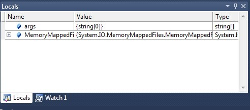
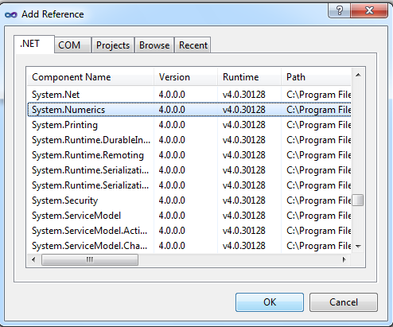

VS2010正式版发布了，从[海报](http://www.cnblogs.com/gnielee/archive/2010/04/12/dot-net-framework-4-namespace.html)中我们可以看到.NET 4在BCL上的改进还是很大的，这一次主要讨论比较Core的变化。

就照海报的顺序说吧。

## System.Collections.Generic
.NET 4中新加入了名为`SortedSet<T>`的结构，这是一个很有用的结构，它在内部维护一个集合，使用`Add()`向`SortedSet`中添加已存在的项时会被忽略，并且返回`false`。

```csharp
SortedSet sortedSetDemo = new SortedSet { 8, 2, 1, 5, 10, 5, 10, 8 };
```
SortedSet和HashSet均实现了新引入的`ISet`接口，其实可以看下`ISet`的签名：

```csharp
public interface ISet<T> : ICollection<T>, IEnumerable<T>, IEnumerable
```
于是可以知道SortedSet是一个集合，同时可遍历，可……

## System.IO.MemoryMappedFiles
这个结构的作用在于将一个文映射到内存中，以达到快速“IO”的目的。其实`MemoryMappedFiles`的真正作用是用作进程间或应用程序间的通信，在内存映射文件中存储相关的信息然后传递。下面这个例子简单演示了如何使用`MemoryMappedFiles`：

```csharp
using System.IO;
using System.IO.MemoryMappedFiles;

using (MemoryMappedFile MemoryMappedFile = MemoryMappedFile.CreateNew("MemoryMappedFileDemo", 100)){
	MemoryMappedViewStream stream = MemoryMappedFile.CreateViewStream();
	using (BinaryWriter writer = new BinaryWriter(stream)){
		writer.Write("hello cnblogs");
	}
}
```
这样我们就将一个名为`MemoryMappedFileDemo`的“文件”写入到了内存，下面的代码说明怎样将它读出来，要注意的是，两段代码不要写在一个应用程序内，否则会报错。

```csharp
using (MemoryMappedFile MemoryMappedFile = MemoryMappedFile.OpenExisting("MemoryMappedFileDemo"))
{
	using (MemoryMappedViewStream Stream = MemoryMappedFile.CreateViewStream())
	{
		BinaryReader reader = new BinaryReader(Stream);
		Console.WriteLine(reader.ReadString());
	}
}
```
难能可贵的是，VS2010对`MemoryMappedFileDemo`提供Debug支持。



## System.Numerics
.NET 4新加入的命名空间，里面包含了两个数据结构：`BigInteger`和`Complex`。`BigInteger`提供了比整型长度更长的数值表示范围，默认值为0，且为不可变类型，如果一些比较特殊的场景整型满足不了需求，可以考虑使用`BigInteger`，相关的辅助方法也会加快的开发效率。

需要注意的是，很多情况下需要手动的引用System.Numberics所在的程序集：



```csharp
BigInteger bigIntegerDemo = new BigInteger(9999999999999999);
if (bigIntegerDemo.IsZero) {
	Console.WriteLine("Equal 0");
}
Console.WriteLine(bigIntegerDemo);
```
而`Complex`则是我们常说的复数类。就像平学数学中的定义一样，一个复数由一个实部与虚部构成：

```csharp
Complex n1 = new Complex(8, 2);
Complex n2 = new Complex(8, 2);
Complex n3 = n1 + n2;
```

## System.Tuple结构
`Tuple`(元组)是一个大小固定的集合主要被设计为与`F#`，`IronPython`等互操作。

```csharp
var primes = Tuple.Create(2, 3, 5, 7, 11, 13, 17, 19);
```
这是一个MSDN官方的例子，完整的元组使用应该是这样：

```csharp
Tuple<int, int, int, int, int, int, int, Tuple<int>> primes = Tuple.Create(2, 3, 5, 7, 11, 13, 17, 19);
```
因为一个元组最大为6，所以想扩展元组必须在最后一个位置上再加一个元组。有了`var`关键字，便使整个过程更简单了：

```csharp
var multiTuple = new Tuple<int, int, int, int, int, int, int,Tuple<int,int,int>>(
	2, 4, 6, 8, 10, 12, 14,
	new Tuple<int,int,int>(3,6,9));
```
访问也简单：

```csharp
primes.Item1;//2
primes.Item2;//3
//...
multiTuple.Rest.Item1;//3
```

## System.Runtiime.InteropServices

新提供的`TypeIdentifierAttribute`特性，可以为一些在类型库中没有`GUID`的类型提供等价类型支持，只需在类型上加`[TypeIdentifier]`即可。

关于.NET 4中Parallel的部分在这个系列的第一篇有部分介绍，我打算将详细的部分例如PLINQ，放到后面的系列来具体讨论。

## 已有类的改进
* `Stopwatch`: `Stopwathc`中新加入了`Restart()`方法，方便我们重置计时器。
* `Environment`: 加入了关于CPU和OS是否为64位的属性：`Is64BitProcess`，`Is64BitOperatingSystem`，并且为了便于使用系统文件夹，新增了一个名为`SpecialFolder`的枚举类型，`Environment.SpecialFolder.Desktop`则表示桌面，`Environment.SpecialFolder.CommonMusic`表示公用音乐文件夹。
* `Stream`: 加入`CopyTo`方法，可以快捷的从一个流拷贝数据到另一个流。
* `Enum`: 过去判断一个[Flag]枚举是否包含某个标志时，通常会使用`&`运算判断是否为空，.NET 4为`Enum`提供了一个更为简便的方法：`HasFlag()`，例如：
```csharp
[Flags]
public enum DataOptions
{
	Data1 = 1,
	Data2 = 2,
	Data3 = 4
}
```
然后可以使用`HasFlag()`来判断是否存在某个标志：
```csharp
DataOptions data = DataOptions.Data1 | DataOptions.Data2 | DataOptions.Data3;
Console.WriteLine("Have Data2? {0}", data.HasFlag(DataOptions.Data2));
```
* `Guid`，`Version`，`Enum`: 现在均增加了对应的`TryParse`方法。
* `String`: 新增支持`IEnumerable`的`Concat()`，`Join()`方法，使用`LINQ`更加的方便，`IsNullOrWhiteSpace()`方法的加入也使对字符串的判断上更加的严谨。
* `File`: 新增支持`IEnumerable`的`ReadLines()`方法，`WriteAllLines()`，`AppendAllLines()`也做为配合而出现，接受`IEnumerable`参数。有理由相信`Directory`是否也有相关的变化，答案是有，具体参见MSDN。

.NET 4的变化很多，一些新特性有待大家一起发掘，更多的内容还是需要在实际的实用中慢慢的体会。下一次如果机会恰当，将研究一些.NET 4特定的技术例如PLINQ等等，不完全局限于CLR和BCL，因为这个话题真正写起来了才发现很空泛，很寂寞……