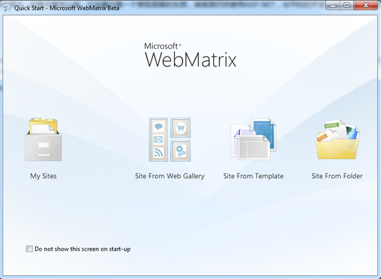
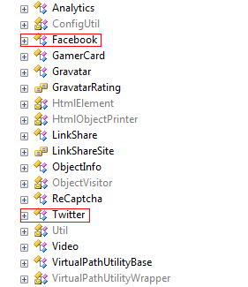

前一段时间，ScottGu在博客上发表了一些有关WebMatrix的文章，其中提到了一个新的ASP.NET视图引擎——Razor。

Razor有着非常简单和干净的语法，但是不管怎么样，它毕竟只是一个表现层面的东西，其底层仍然使用ASP.NET，与平时的开发没有什么大的区别，唯一的区别在于：视图的简洁。

## 安装
使用Razor需要安装 Microsoft ASP.NET Web Pages，当然，官方的做法是：直接用Web Plamform安装WebMatrix，不过WebMatrix现在还处于Beta阶段，估计以后会增加更多支持Razor的功能。

安装完毕后打开WebMatrix，然后就可以通过Site Form Template来新建一个站点测试了。



默认生成的站点在“我的文档”My Web Sites下以站点名命名。

## 初窥
Razor的语言简单之极，只需记住一个字符就可以：`@`。

在传统的ASP.NET视图引擎中，如果我们要进行一些数据绑定或者逻辑判断就会使用类似下面的做法：

```
<%
	var testStr1 = "Hello";
	var testStr2 = "lurongkai";
%>
```
我们先搞了两个变量，当然，这些变量可以从任意的地方获得，然后，我们将这两个变量绑定到页面中去：

```
<%= testStr1 %>,Your name:<%= testStr2 %>
```
不知道您看的如何，总之我感觉是够乱的。

同样的东西，我们用Razor的语法来重写，会是怎么样的呢？

```
@{
	var testStr1 = "Hello";
	var testStr2 = "lurongkai";
}
@testStr1,Your name:@testStr2
```
当然了，结果是一样的，不过在表现力上显然Razor更胜一筹，因为来回的`<% %>`看的人眼花，例如下面这个MVC中登陆部分的用户控件：

```
<% if (Request.IsAuthenticated) { %>
	欢迎您，<b><%: Page.User.Identity.Name %></b>!
	[ <%: Html.ActionLink("注销", "LogOff", "Account") %> ]
<%  } else { %>
	[ <%: Html.ActionLink("登录", "LogOn", "Account") %> ]
<%  } %>
```
我唯一的感觉：晕！用Razor后：

```
@{
	if(WebSecurity.IsAuthenticated) {
		@:欢迎您,<b>@WebSecurity.CurrentUserName</b>!
		@Html.ActionLink("注销", "LogOff", "Account")
	} else {
		@Html.ActionLink("登录", "LogOn", "Account")
	}
}
```
是不是更加的人性一些呢？唯一需要说的就是@:，这是说它后面的内容是混合内容，即有纯文本又有服务器端代码。不过上面的代码我没有做过测试，这是改成了Razor的样式，所以大家谨慎参考。

## Helper
严格的讲这部分不能算语法层面上的特性，只能算是支持Razor的辅助类库。因为Razor实在过于简单了，说白了就一个@，只要会C#或才VB.NET就行，以前的知识全部能用，所以为了使内容不那么水，我将这部分也加了进来。完整的文档请到[这里](http://www.microsoft.com/downloads/details.aspx?FamilyID=b7937c34-3b53-47b7-ae17-5a72fa700472&displaylang=en)下载PDF文档，上面详细说明了Razor的细节（还有前面提到的Microsoft ASP.NET Web Pages安装包）。

## 类似于传统ASP.NET的母版页、用户控件机制
在呈现类似用户控件的内容时（说白了就是用户控件），可以使用`RenderPage`辅助类，例如：

```
@RenderPage("/Shared/_Header.cshtml")
@RenderPage("/Shared/_Footer.cshtml")
```
而所谓的“用户控件”其实就是一个没有`<html>`的裸页，将经常会使用的一部分逻辑或者内容分离出来以达到复用。

母版页可以提供统一的外观，按照原来的思路，一般会在母版页中插入`ContentPlaceHolder`控件来指明哪部分是要被使用页来替换内容的，在Razor中，它不叫`ContentPlaceHodler`，叫`RenderBody`。

不同的时，传统ASP.NET可以在母版页中插入多个`ContentPlaceHolder`，而`RenderBody`只能有一个。其实，类似`ContentPlaceHolder`，Razor中也提供`RenderSection`来实现。

先说`RenderBody`。当我们在母版页中的某个位置写了`@RenderBody()`后，接下来在使用母版页时，只需在页面的顶部写入：`@{ LayoutPage = "MasterPageLocation"; }`，这样，接下来的内容会自动填充到母版页`RenderBody()`对应的位置：

MasterPage:

```
@RenderBody()
```
Page:

```
@{
	LayoutPage = "/Shared/_MasterPage.cshtml";
}
```
使用`RenderSection`时需要指定Section片断的名字，
我们可以在母版页中的相关位置上写上`@RenderSection("name")`，然后在使用母版页的页面中声明类似的Section，即：`@section header {/*HTML or other*/}`，具体如下：

MasterPage:

```
@RenderSection("someSection")
```
Page:

```
@sectionsomeSection {
	<div id="someSection">
		someSection
	</div>
}
```

## 对Microsoft SQL Server Compact Edition数据库的辅助类
这个比较简单，就是通过`Database`类来操作数据。例如最常用的“查”：

```
@{
	var db = Database.OpenFile("database.sdf");
	var selectQueryString = "SELECT * FROM Table1";
	var data = db.Query(selectQueryString);
}
```
查出来的数据想怎么着就怎么着吧，管不着了……

很简单不是么？至于“增”，“改”，“删”都用`Database.Execute()`方法来完成。

## 文件上传与Image处理
对于常用的文件上传功能，Razor做了封装，让我们使用更加的方便，只需简单的在页面上使用FileUpload类的相关方法即可，配合Razor的清爽语法，可读性非常高：

```
@FileUpload.GetHtml(
	initialNumberOfFiles: 1,
	allowMoreFilesToBeAdded: false,
	includeFromTag: true,
	uploadText: "Upload"
)
```
配合C#4.0的默认参数，一个文件传的功能就实现了（其实我觉得更像是一种使用控件）生成的HTML如下：

```
<form action="" enctype="multipart/form-data" method="post">
	<div id="file-upload-all-files">
		<div>
			<input name="fileUpload" type="file" />
		</div>
	</div>
	<div id="file-upload-buttons">
		<input type="submit" value="Upload" />
	</div>
</form>
```
对于更加常见的Image，Razor也做了相应的封装：`WebImage`，常用的一些方法如下：

```
WebImage.Resize(); //改变图像大小
WebImage.FlipXXXX(); //图像旋转，XXXX对就旋转方向，例如Vertical垂直翻转，Horizontal水平翻转，Left,Right……
WebImage.AddTextWatermark(); //在图像上加入文字水印
WebImage.AddImageWatermark(); //在图像上加入图像水印
```

## 视频
对于常见的视频需求，Razor提供了简化手动配置视频标签的辅助类：`Video`。当下最为流行的网页视频播放无非3种：Flash，Windows Media
Player，Silverlight，至于HTML5的先天支持那是后话。`Video`充分利用C#4.0默认参数的威力，使得生成一个视频标签也是手到擒来：

```
@Video.Flash(
	path: "testFlash.swf",
	width: "400",
	height: "600",
	play: true,
	loop: true,
	menu: false,
	bgColor: "red",
	quality: "medium",
	scale: "exactfit",
	windowMode: "transparent"
)
```
至于Windows Media Player和Silverlight就不多说了，大同小异，有兴趣可以研究`Video.MediaPlayer()`，`Video.Silverlight()`。

## 社交网络操作的简化
天朝上不了Twitter，但是世界处处却留下了Twitter的影子……作为时下最火的社交网站，我等暴民经常爬出去上推，扯远了……Razor提供了对诸如Twitter，Facebook，Gravator，ReCaptcha等一些社交网络经常提及的网站的简化，使得跨站点的资源调用更加方便，用Reflector看了一下`C:\Program Files\Microsoft ASP.NET\ASP.NET Web Pagesv1.0\Assemblies`下的`Microsoft.WebPages.Helpers.Toolkit.dll`，我们发现：


其中提供了很多有用的封装，不过，可惜，可惜……

看一个简单的例子：

```
@Twitter.Profile("haacked")
```
运行如下：



小梯子一搭，走您的…………

## 总结
Razor作为传统ASP.NET视图引擎外的新选择，使得Web开发中“视图”部分更加的清爽。在这里我并不是在鼓吹新技术、新特性，或者是抱着new features抚摸来抚摸去，大家仁者见仁智者见智吧，毕竟这个新东西实在很简单，只是一个新的视图引擎。

在下一版本的ASP.NET MVC中，Razor也会被加入可选的视图引擎之一，而我在下面给出的链接中已经[有人](http://www.cnblogs.com/chsword/archive/2010/07/10/razor_in_aspnet_mvc_2.html)将这一想法提前实现了，我想MVC的表现力再加上Razor的简洁定会使开发更加的愉快。

1. [为ASP.NET MVC 2.0添加Razor模板引擎 (on .NET4)](http://www.cnblogs.com/chsword/archive/2010/07/10/razor_in_aspnet_mvc_2.html) - [重典](http://www.cnblogs.com/chsword)
2. [ASP.NET Web Pages with Razor Syntax](http://www.microsoft.com/downloads/details.aspx?FamilyID=b7937c34-3b53-47b7-ae17-5a72fa700472&displaylang=en)
3. [Microsoft WebMatrix in Context and Deploying Your First Site](http://www.hanselman.com/blog/MicrosoftWebMatrixInContextAndDeployingYourFirstSite.aspx) – [Scott Hanselman](http://www.hanselman.com/blog)
4. [WebMatrix](http://www.microsoft.com/web/webmatrix/)
5. [Introducing “Razor” – a new view engine for ASP.NET](http://weblogs.asp.net/scottgu/archive/2010/07/02/introducing-razor.aspx) – [Scott Guthrie](http://weblogs.asp.net/scottgu)
6. [Introducing WebMatrix](http://weblogs.asp.net/scottgu/archive/2010/07/06/introducing-webmatrix.aspx) – [Scott Guthrie](http://weblogs.asp.net/scottgu)