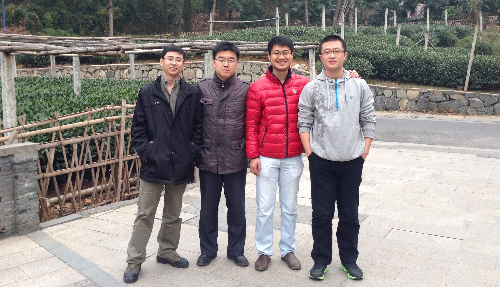
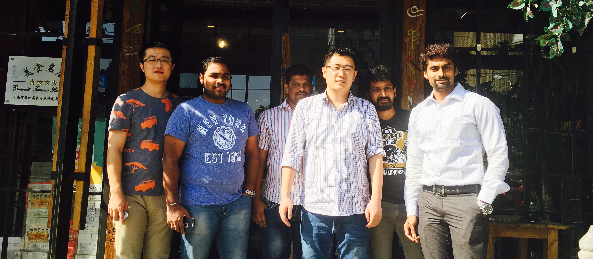
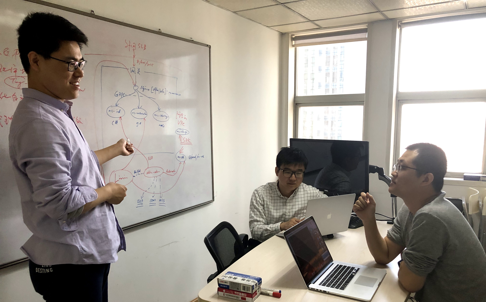
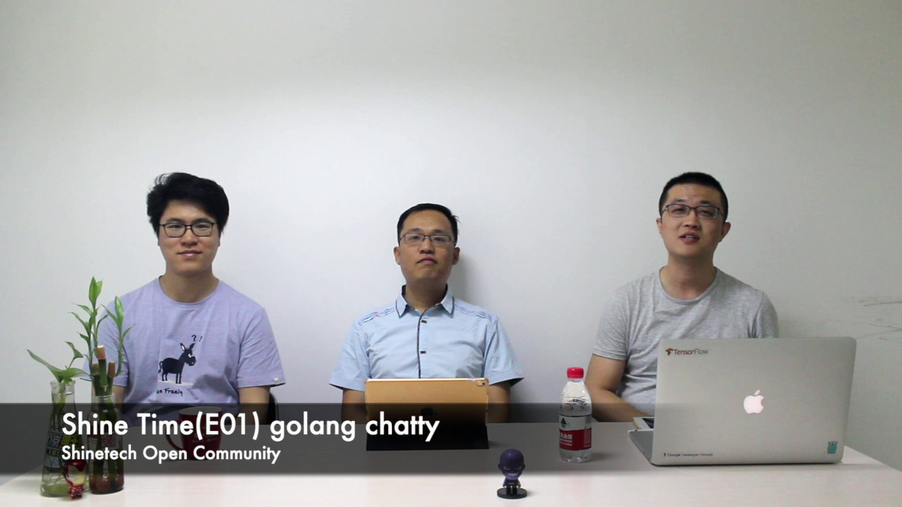
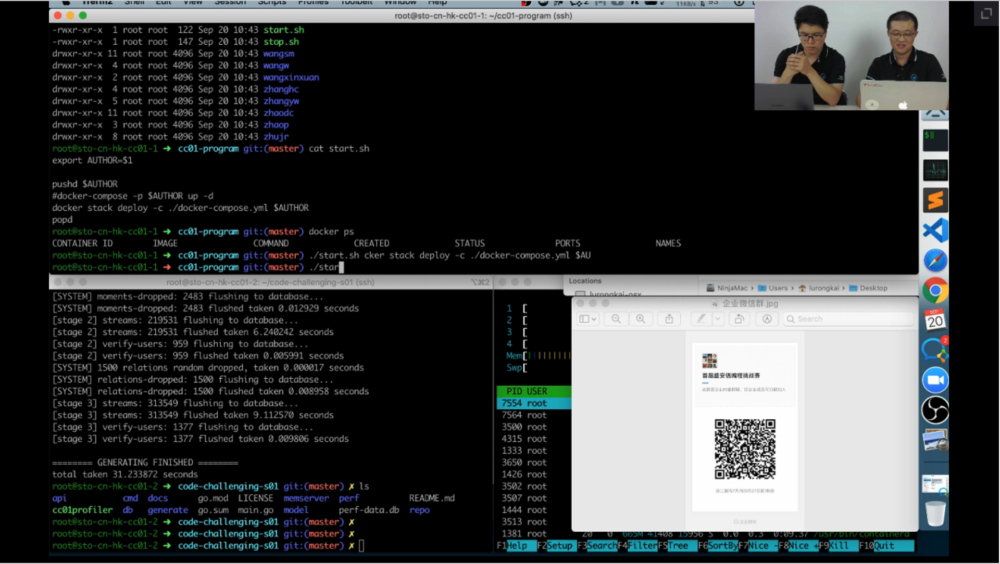
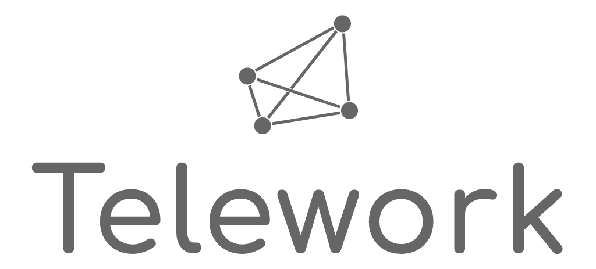
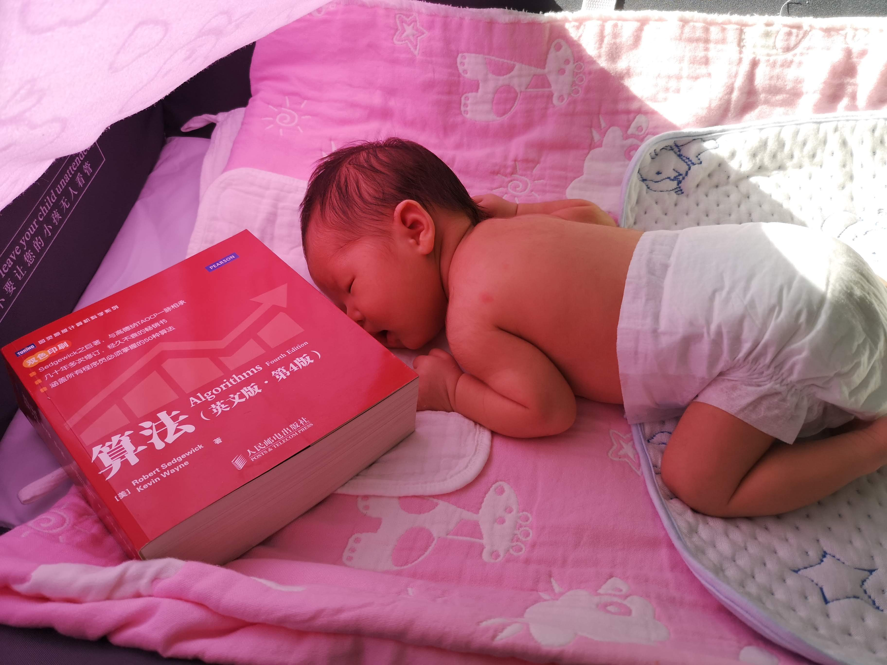

## 引子

2011 年的一个上午，在工作一个星期后，我离开了毕业后第一份工作。然后用当周的薪水买了一台显示器和十几本书，决定闭关修炼一个月。后来的事实证明，显示器只有在玩游戏和刷剧时才能发挥最大的功效，而书虽然会给搬家增加负担，但好歹是不错的投资。

当时的事业部负责人才签字时，流露出一种“刚毕业的小白竟然敢如此造作”的狐疑表情，问我为啥离开？我说不适合公司文化。

事实上，小组里的人都在加班，但即便自己没有任何的开发任务，却被要求“陪着”加班……加班费正常给、管餐、打车报销，除了不能上网（物理上）、USB 全封、禁止带书和 kindle……能做的只有玩手机，以及玩没电后睡觉，迷之文化。

我决定，下一份工作一定得找个文化上比较 open 的公司。

## 初识

在昏天黑地的刷了 N 部剧后，我决定开始找找新机会。刚好在博客园上注意到盛安德在天津招 5 年经验的高级软件工程师，抱着“我脸皮厚我怕谁”的态度投了唯一一份简历，没想到就收到了面试邀约。

整个过程就很奇妙，和@Russel 聊了两个多小时，已经想不起聊了些啥，反正就知道河西分公司刚成立，办公室新租的，桌子是刚买的，人呢就@Russel 自己……

于是你哈哈哈我哈哈哈，聊的很开心的一周后，我成为了 Shinetech 天津河西分公司的 03 号员工，02 号是@温融晶。

## 小项目

一切从最简单的项目开始。我们做了几个规模相对小一些的小项目，最终都成功交付。当然了，对于我而言，最为重要的是，终于弄清楚了公司的主营业务是什么，以及管理架构是什么样的……

这非常奇妙，就是一切的关注点都在项目和交付上。我当时最大的困惑就是，这公司到底有多少人……真的不是皮包公司吗？

陆续的，有更多的小伙伴加入了进来，我同校的学长@Nick，和我简直不要太对脾气@Jaime（我们经常起个头就知道接下来要说什么、优缺点是什么）……这下放心了，应该不是骗子公司:-P。他们加入后，技术氛围就更加浓烈了。后来@Vivian 也和我们在同一个办公室工作，大家有说有笑，气氛非常好。

说到这里，还有点想@Jaime 了。

## Ralph Lauren

12 年的时候，@Russel、@温融晶和我三个人前往美国 Texas，着手 Ralph Lauren 的项目，这是我加入 Shinetech 后真正意义上的大项目，我们在 Austin 停留了近两个月了解和参与业务，为接下来的两年工作打下了基础。

那一段日子可谓是异常的潇洒，白天忙碌，晚上看看资料或者压压马路，到了周六日就在一起打打游戏，Diablo II、CS、Red Alert 全部复习了一遍。不工作的时候，最费脑子的就是去哪家餐馆吃饭的问题。期间去当地的景点玩，进去后才发现是类似于我们爱国主义教育基地的地方，回忆起来也是颇为有趣。

回国后项目正式开始，@Russel 在项目上投入了极大的精力，正是他的不懈努力，这个项目逐渐成为公司的明星项目。一年后，客户来上海审查我们的项目，我被任命为这个项目的 Technical Leader，这是在技术能力上得到了认可，非常开心。

两年后，我想要换换思路，决定暂时先别这个项目，同一时间，@Robert 加入了公司，是个去吃自助大餐要先来碗白饭的神人，非常有意思。

几年的工作很充实，但是却几乎没有加班过。其实实践不加班是很难的，但是 Shinetech 在这一点上践行的很彻底，值得尊敬。

(Ralph Lauren 团队在上海)

## 看看世界

15 年的时候，生活和工作趋于过分的平静，我感到这是个危险的信号，所以我决定给自己点时间去外面的世界看看。其实我一直很感谢@Russel 的赏识，他建议我去北上广历练一番，于是还是老规矩，休息一个月，然后在北京投了两个相对高阶的职位。

都是移动互联网公司，一家 B 轮，一家天使轮，考虑了一下去了天使轮的公司。倒不是因为给期权，而是感觉可以做更多的事情。

传统软件公司的思路和互联网公司的思路真是完全不同，前者做事稳妥但是缺乏创新和敏捷（虽然口号是敏捷），后者行事快速果断但是大多只追求了速度，基础设施薄弱。

这一年积累和认识了颇多，更多的是包容。没有完美的方案，只有在成本范围内适合的方案，这也是最为刻骨铭心的架构准则。

我带来的是对整个技术团队基础设施和技术栈的升级，同时重构协作文化（没错，导入了敏捷开发）。而回馈给我的，是互联网公司更加自驱动的做事文化，这在传统软件公司是极度欠缺的。

这段经历对之后面对大流量高并发场景的应用做设计有很多的指导意义，在 Shinetech 其实算是一块短板，也是受目标客户的业务的所限制。但是碰巧在不久后进入了万门大学项目，一切都显得水到渠成。之后因为当时女朋友（现在的老婆）在天津，往返于两地间也是很疲惫，于是一年后决定回来天津，开始彻底的 SOHO。

## 再次回归

回来后又躺了半个多月（厄……），我给@Robert 发了条消息，胡汉三又回来了。

公司变化不大，认识了非常棒的伙伴@Larry，我们之后在一起做了很多有意思的事情。

这种感觉很熟悉，紧接着和@Robert 做起了合伙人，招进了非常优秀的@李宏。我们同时跟进了几个潜在的优质项目，但是摊子铺的太大，经验不足又因为一些别的原因，导致风险骤增，没多久就陷入了亏损，于是几个月后，我们开始采用交付中心机制。

(Square Panda 团队在北京)

戏剧的是，进入交付中心后我们分别有了更好的项目。@Robert 进入了 William O'Neil 明星项目，我和@Larry 还有@李宏共同进入了万门大学项目，后来@温融晶也加入了进来，大家分别在项目上有了长足的表现。

带着传统软件公司稳健的做事风格，以及互联网公司的实践经验，我们迅速的把万门大学的项目做的红红火火，两年的时间流量翻了近 50 倍，服务器的规模从最初的 2 台主机到现在的 100+台主机。

(万门大学团队在讨论方案)

## 更有趣

19 年的时候，天津的小伙伴聚餐，提到了一些有意思的想法，我们决定在工作之外尝试性的做一些有意思的事情。那就是 Shinetech Open Community。

带着这种热情，从去年的春天开始，SOC 做了一系列富有创意和激情的活动。除了十几场的技术分享，还有实验性的播客（和@Larry 一起，做了三期）、系列博客，定期的编程挑战赛、读书会等。

(ShineTime Podcast)

(编程挑战赛第一季直播评分)

(读书会-Conan 正在精彩分享)

一群来自不同的分公司的小伙伴玩的不亦乐乎，我们甚至打算在今年做 Tech Days（由于疫情和一些其它因素还没有实施）。同时，也为公司带去了一些更有利于工程师开展工作的设施，例如 gitlab，将来也一定会无偿的提供更多优质的工具，让 Shinetech 变的更加的贴近工程师文化。

第二届编程挑战赛后，一个新的计划应运而生，那就是远程工作社区。在公司的支持下，我和@Larry、@Nick、@Conan 一起发起了中立社区 telework.club，成立远程工作社区工作组，为更多的企业、个人在未来实践和采纳远程工作方式提供一些帮助，虽然还没有最终发射，但也为期不远了。

更有趣，这是重回 Shinetech 后最大的感受。

## 回顾

Shinetech 是一家有独特公司文化的公司，在这里有包容、有开放，更重要的是，有一帮非常棒的人。

9 年的时间并不算短，到如今我依旧深爱着技术，并希望写代码到 60 岁。从二十多岁的我到如今我的孩子一岁，都是和 Shinetech 一路走来，我看到了整个行业更多的可能性，这是最好的时代，愿 Shinetech 和我们一切都好。

(传我的衣钵，这事得抓紧)
